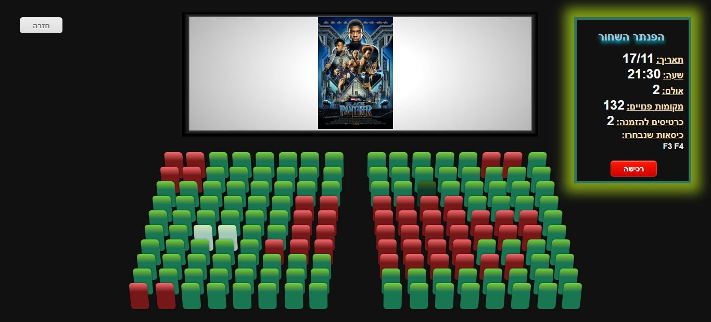
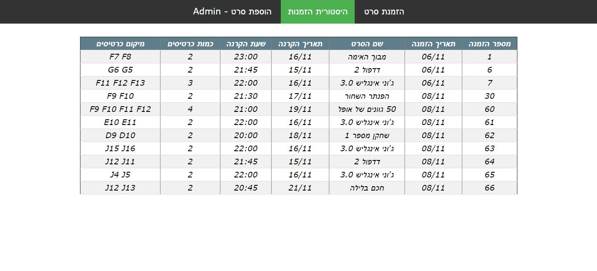
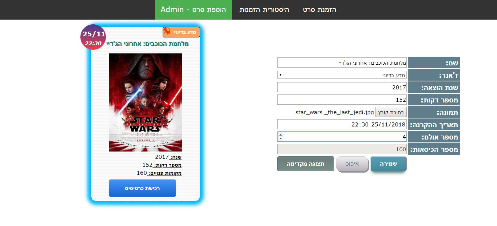

# Server_Side_Final_Project

# Cinema online purchase system

Online purchase system for Cinema.
 
This project is based on the 4-layer model:
- Database (Sql server)
- Data access (Class library, Entity framework)
- Business logic (Web service, Web API)
- UI (JS, HTML, CSS, jQuery)
 
<h2>Screenshots:</h2>
                                                                                                                               

    <h3>1. Moives List</h3>
    Chose a movie for order
    
    

=================================================================================

    <h3>1. Hall Page</h3>
    Chose your seats positions and finish your order
    

=================================================================================

    <h3>2. Orders History</h3>
        <h3>Including all the user's purchase history</h3>
                                                                                                                                   
    

=================================================================================

    <h3>3. Admin Page</h3>
        <h3>Gives the admin the posibility to add a new movie to the cinema</h3>
    

